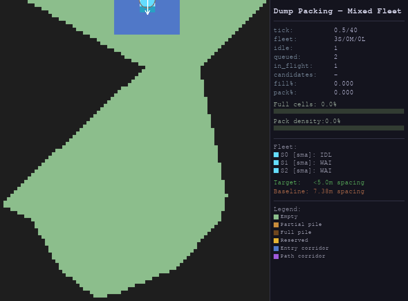
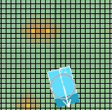
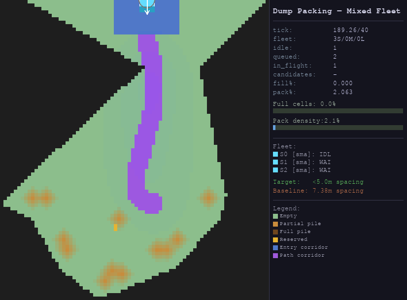
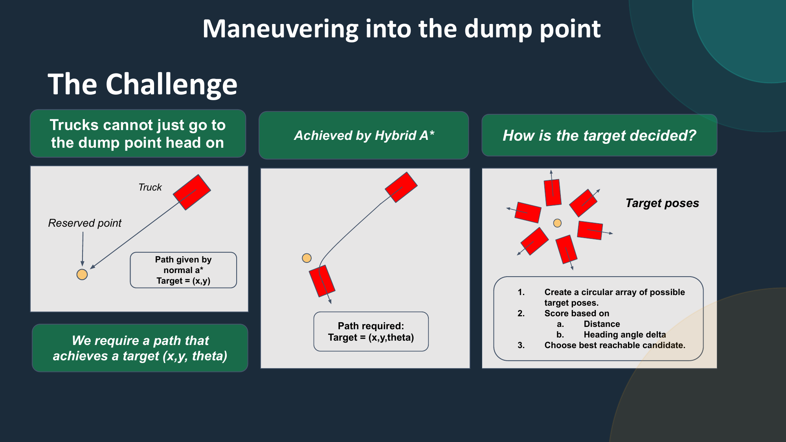
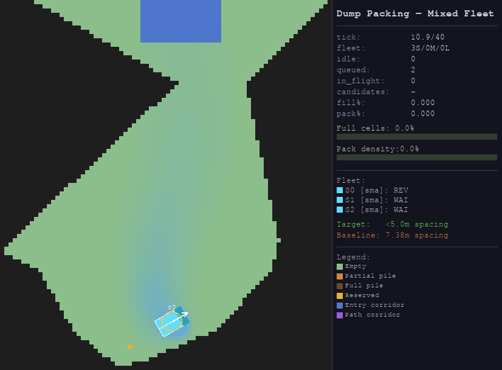
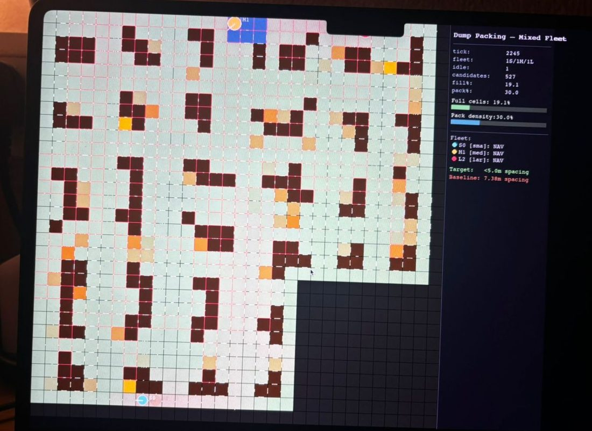
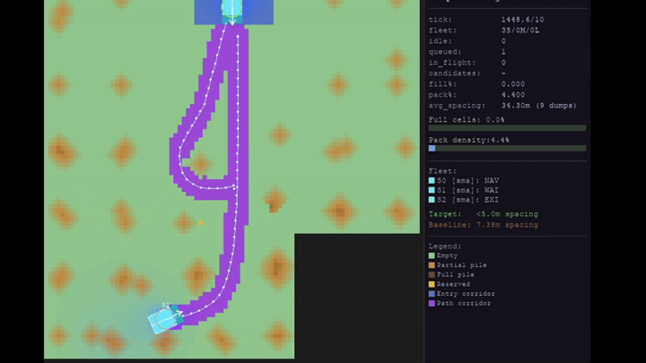
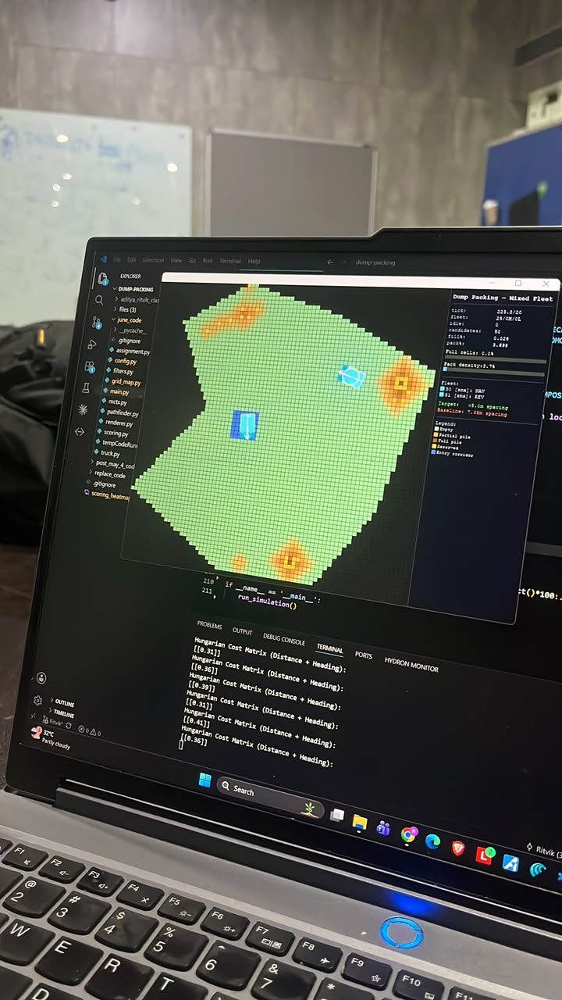

# Optimal Dump Packing

**Multi-Agent Autonomous Dump Truck Simulator for Optimizing Paddock Dump Packing Density**

*National Tech Challenge 2026 hosted by Caterpillar*

*Source: `final_code/` folder, `origin/master` branch. See §7 for why this specific folder/branch.*

> **Status note, read this first.** The **single-agent pipeline** - world representation, candidate generation, scoring, MCTS ranking, and single-truck path planning is stable and working end-to-end. The **multi-agent coordination layer** (Conflict-Based Search across several simultaneously-moving trucks, proactive conflict detection, deadlock/freeze recovery) is implemented and functional but still being made robust against agent-agent collision avoidance.

---

## 1. The problem, briefly

Dump-site packing today is done in two decoupled steps: pre-place a fixed grid of "spot points" over the polygon (the paddock dump region), then plan fixed lanes to each one. This is brittle for three reasons the problem statement calls out directly:

1. **Mixed fleets break fixed spacing.** A grid sized for one truck class leaves gaps when a smaller truck dumps to it, and there's no principled way to pre-plan arrival order for trucks of different sizes.
2. **Irregular polygons leave dead zones.** A regular spot-point grid never tiles an irregular paddock boundary exactly so the corners are always wasted.
3. **Spot points must be over-spaced defensively**, so a truck's own reversing/route-planning software doesn't mistake a neighbouring pile for an obstacle. This defensive spacing is *why* today's autonomous operations run at **~7.4 m** truck spacing against a staffed-operator benchmark of **~3.0 m** - the gap this project targets.

**Our solution** removes the pre-defined plan entirely: no spot-point grid, no pre-planned lanes. Every dump location is chosen **live** from the current terrain state, and every truck's route is planned (and re-planned, as the terrain changes under it) by a general-purpose multi-agent motion planner. The bet is that a system that *reasons* about the terrain on every decision rather than following a plan drawn up before any truck moved can pack closer to the staffed-operator density even with a fleet of unknown, mixed truck sizes on an arbitrary polygon.

## 2. Algorithmic pipeline & theory

The system is a closed decision loop, repeated for every truck that becomes free:

```
 World Model → Candidate Generation → Multi-Heuristic Scoring → MCTS Lookahead
      ↓                                                              ↓
 Terrain updates ←── Execution (drive, reverse, dump) ←── Assignment ←── top dump points
      ↑                        ↑
      └── Multi-Agent Path Planning (CBS) ──────────────────────────┘
```

Each stage below is a distinct algorithmic problem with its own theory; the implementation notes for each live in §7.

### 2.1 World model: a discretized grid to model vehicle dynamics and debris piles

**Random polygon generation**


*A randomly generated dump-site polygon at tick 0 — this is an actual run of the codebase (`random_shaped_algo/polygon_gen.py`), not a mockup. Irregular, non-rectangular boundaries like this are exactly the case pre-defined spot-point grids handle badly (§1), and generating a fresh random one on every run is what lets this get tested for realism rather than tuned to one fixed shape.*

The polygon is rasterized into a uniform grid, and every dump is simulated as an actual granular pile rather than a block-fill of one cell. A dumped volume `V` forms a cone whose radius is derived from the angle of repose `θ` (the maximum slope loose material can hold before it slides - configured at 35°, typical for waste rock):

```
V = (1/3)·π·r²·h,   h = r·tan(θ)   ⟹   r = ( 3V / (π·tanθ) )^(1/3)
```

Material is deposited across every cell inside that radius, then an iterative relaxation pass caps the slope between any two adjacent cells at `tan(θ)` which is the same way real debris piles self-level. This matters for the whole pipeline downstream: packing density, accessibility, and even where the *next* truck can physically stand are all read off a terrain model that behaves like real dumped material, not an idealized grid of on/off cells. It's also what makes "spot points must be defensively over-spaced" (the failure mode this project is designed around) directly testable so the simulator can't cheat by ignoring realistic pile geometry.

Two grid resolutions are kept simultaneously: a **fine grid** (1 m cells) for smooth turning, cone geometry, and low-spot detection, and a **coarse grid** (3 m blocks) for flood-fills, fill-percentage, and candidate scoring. The coarsening is what keeps reachability checks (§2.2) cheap without losing correctness.

| Debris cone gradient (fine grid) | Overlapping piles after multiple dumps (live run) |
|---|---|
|  |  |

### 2.2 Candidate generation & accessibility

Not every empty cell is a legal dump target. Two constraints must hold, both stated explicitly in the problem brief:

- **The truck must physically fit.** A candidate is only valid if the truck's full rectangular footprint clears the polygon boundary at *some* reversing heading — this is a geometric fitting check, not a single-point-in-polygon test.
- **The dump must not isolate part of the polygon.** A pile that seals off a pocket of the site behind it is a hard failure condition. This is a graph-connectivity question: is every other reachable cell still reachable from the entry point *after* this hypothetical dump?

The second check is the expensive one. Naively it's a full BFS over the grid for every candidate cell. The key theoretical shortcut used here: **isolation is a topological property**, so it can be tested on the coarsened grid without losing correctness, as long as the coarsening factor is smaller than the smallest obstacle the check needs to detect. This turns an O(cells) BFS per candidate into an O(cells / block²), a large constant-factor speedup with no accuracy loss for this specific question. A cheap local pre-filter (is this cell "pinched" by two or more blocked neighbours at all?) additionally skips the BFS outright for the common case where a cell obviously isn't a chokepoint.

> 🖼️ **Add a picture here** — a before/after pair showing a candidate dump that *would* isolate a pocket (rejected) vs. one that doesn't, or an overlay of the driveable mask at one heading. Suggested filename: `accessibility_check.png`. This stage doesn't have a natural renderer view yet since it's an internal filter — a debug overlay (even a quick matplotlib plot of the BFS-reachable set) would work well.

### 2.3 Multi-heuristic scoring: a phase-adaptive weighted objective

Ranking candidate cells is a multi-objective problem — no single signal captures "a good place to dump next." Six heuristics are combined into one scalar via a weighted sum:

| Heuristic | What it optimizes for |
|---|---|
| **Density** | Cluster new material near existing piles (natural pile growth, fewer isolated small piles) |
| **Coverage** | Spread dumps across the whole polygon rather than over-filling one region |
| **Height gap** | Prioritise cells furthest from the target pile height |
| **Pheromone** | Avoid areas dumped very recently (an ant-colony-style repulsion signal that decays and diffuses each tick) |
| **Boundary priority** | Fill the polygon's edges before its centre |
| **Entry distance** | Dump far from the gate before dumping near it, so later trucks aren't blocked from reaching the back of the site |

A fixed weighting is wrong for the whole run: early on, the priority is getting material *deep* into the site before the entry corridor silts up; mid-run the priority shifts to clustering and gap-filling; late-run, distance from the gate stops mattering (everything is reachable) and it becomes almost pure density + evenness optimization. The implementation encodes this as three weight vectors selected by current fill percentage — a simple, interpretable **phase-based control policy** rather than a single static objective.

### 2.4 MCTS lookahead: correcting for the greedy heuristic with long horizon planning

The heuristic score above is *local* - it has no notion of what happens two or three dumps later. A greedy "always take the top-scored cell" policy is known to create isolated unfillable pockets: a cell that looks great right now might be the last cell a truck can reach next to a wall it's about to seal off.

**Monte Carlo Tree Search** corrects for this by simulating a few dumps ahead before committing to the first one. The tree is built directly on top of the decision being made: **each node represents one candidate dump — one specific cell chosen as "the next thing this truck dumps at."** A path from the root down through several levels of the tree is therefore a hypothetical *sequence* of future dumps, not just a single choice, which is exactly what lets the search reason about consequences a few moves out rather than one at a time. **UCB1** governs which node to expand next, balancing exploitation of cells that have scored well so far against exploration of cells that haven't been tried much yet:

```
UCB1(node) = value/visits + c · √( ln(parent_visits) / visits )
```

Leaves are evaluated by rolling out several more (randomly chosen, heuristically-plausible) dumps and scoring the resulting hypothetical terrain on **packing density minus an isolation penalty** — cells that would end up boxed in on three or more sides by filled neighbours are penalised. The most-visited child at the root is read off as the recommended move — visit count rather than raw score, because under UCB1 visit count is itself the algorithm's confidence signal about which branch is actually good, not just lucky on one rollout.

> **Alternative considered - pure greedy scoring (no lookahead).** Taking the top heuristic-scored cell directly, with no MCTS correction, risks unfavourable future states — exactly the isolated-pocket failure mode above. MCTS is what lets the system reason about *consequences*, not just the immediate score.

### 2.5 Assignment: optimal bipartite matching, not greedy nearest-cell

Once a batch of dump points is chosen, the fleet's idle trucks need to be matched to them. The naive approach — each truck greedily claims its nearest point — is a classic degenerate case: two trucks can both "want" the same close cell, and the fix (whoever claims it first wins) produces a global routing plan that's often much worse than the best available assignment, even though every individual choice looked locally reasonable.

This is the assignment problem in its classical form: given an `N×M` cost matrix, find the one-to-one matching that minimizes total cost. The **Hungarian algorithm** solves this exactly in `O(N³)` — real-time feasible for the fleet sizes here (single digits to ~15 trucks). Cost combines normalized Euclidean distance with a heading-misalignment penalty scaled by each truck class's turning radius (a large, wide-turning truck pays more for a bad approach angle than a small, tight-turning one, since it has less room to correct on the way in).

The team's own design notes also describe a tentative third cost term — a truck-size/spot-compatibility factor (`w_ls · spot_compatibility(truck, cell)`) — to bias assignment further by how well a given truck class fits a given candidate spot; this isn't implemented in `assignment.py` on this branch yet, but is a natural next extension of the same cost matrix.

> **Alternative considered — greedy nearest-distance matching.** No global optimum, no heading term, and prone to exactly the "two trucks want the same cell" conflict described above. The Hungarian algorithm (via `scipy.optimize.linear_sum_assignment`) guarantees the globally minimum-cost matching instead.

### 2.6 Single-agent path planning: kinematics, staging, and reversing into the dump point

A real haul truck can't turn on a point — it has a minimum turning radius, and a path that ignores this is unusable. The planner works in two layers:

1. **Coarse search**: A* over the grid, but the state includes a discretized heading (8 buckets), and turning is explicitly penalised in the cost function — this biases the search toward paths that are already close to kinematically feasible before any smoothing happens, rather than a shortest-path-regardless-of-turns route that then has to be forced into shape.
2. **Continuous smoothing**: the coarse cell path is converted into a smooth rear-axle trajectory using a **bicycle kinematic model** — the standard simplified vehicle model where steering angle `δ` and wheelbase (approximated by truck length `L`) fix an achievable turning radius `R = L / tan(δ)`. The smoother looks one radius ahead along the coarse path and clamps any target that would demand a tighter turn than the truck's configured minimum. The result is a trajectory the truck can physically drive, not a sequence of grid-snapped jumps.

**Why this isn't enough on its own — the reversing problem.** A truck can't just drive straight at the dump target and stop: real haul trucks back up to the dump face. That means the planner needs to reach a *specific final orientation*, not just a point — a path to `(x, y)` from plain A* isn't the same problem as a path to `(x, y, θ)`.



This is solved in two parts:

- **Hybrid A\*** is what actually reaches the pose. Where the coarse planner above expands unit grid steps, hybrid A* expands **continuous bicycle-model arcs** — each node in the search is a full `(x, y, θ)` state reached by a kinematically-valid arc from its parent, so the path that comes out is already drivable by construction, with no separate smoothing pass needed to hit the final heading exactly.
- **The target pose itself is chosen from a circular array of candidates.** Rather than trying to reverse-engineer one "correct" staging pose analytically, the planner samples a ring of candidate poses around the dump target at the truck's required clearance radius, scores each by distance and heading-change from the truck's current position, discards any that aren't actually driveable or don't have a clear straight reverse line into the target, and picks the best of what's left. This is the same "generate candidates, score them, pick the best" pattern used for dump-point selection in §2.3 — applied here at the level of a single truck's final approach.

The truck then drives to the chosen staging pose (via hybrid A*), turns to face away from the target, and reverses in a straight line the remaining distance — mirroring how a real operator backs up to a dump face rather than driving straight at it.

| Live: a truck in `REVERSING`, backed up to its staging pose | Live: the CBS-planned corridor leading a truck to reverse in (from the team's demo) |
|---|---|
|  |  |


### 2.7 Multi-agent path planning: Conflict-Based Search

Planning every truck's route independently and hoping they don't collide doesn't work — decoupled plans routinely intersect in space and time even when each one is individually optimal. **Conflict-Based Search (CBS)** is a two-level algorithm built for exactly this:

- **Low level**: a *space-time* A* — the search state is `(row, col, heading, time)` instead of just `(row, col, heading)` — with an explicit "wait in place" action. Given a set of hard forbidden `(cell, time)` triples, this always finds the best path for one truck that respects them.
- **High level**: a constraint tree. Plan every truck independently first (empty constraint set). If any two trucks' resulting paths conflict, branch: create two children, one forbidding truck A from the conflicting cell at that timestep, one forbidding truck B, and replan only the affected truck in each child. Expand the lowest-total-cost node first (best-first search). The first node reached with *no* remaining conflicts is returned.

Two conflict types are checked: a **vertex conflict** (two trucks' bodies would overlap at the same instant) and an **edge conflict** (two trucks swap cells between consecutive steps — a head-on pass-through). Because trucks are rectangles, not points, "overlap" is resolved with a **separating-axis theorem (SAT)** test on the two oriented rectangles, so trucks in adjacent, non-intersecting lanes aren't false-flagged just for being in nearby grid cells. Grid-cell proximity is a necessary condition for a real conflict, not a sufficient one — SAT is what tells the difference.

CBS is complete and returns the optimal conflict-free solution *if* the constraint tree is searched exhaustively; in practice the search is bounded (a node cap) for real-time performance, and falls back to the best-effort node found if the cap is hit before a fully conflict-free solution is reached. This bounded-search tradeoff — and how well it holds up as truck count grows — is exactly the part of the system still being characterised (§2.9).

> **Alternatives considered.** *Independent A\* per truck* has no collision avoidance at all — trucks simply drive through each other. *Fully centralized space-time A\** (planning every truck jointly in one combined search) does guarantee collision-free paths, but its state space grows exponentially with truck count, making it computationally impractical at fleet scale. CBS sits between the two: cheap in the common (conflict-free) case, and only pays the cost of joint reasoning exactly where two trucks actually interact.


*A real run with a mixed fleet — all three trucks routing simultaneously, each planned by CBS against the others' reserved corridors.*



### 2.8 Deadlock & liveness

Any coupled multi-agent motion-planning system operating in a bounded space with a single shared entry point can, in principle, reach configurations CBS's cost-minimizing search doesn't cleanly resolve — two trucks nose-to-nose in a corridor too narrow to path around each other, for instance. The system carries two categories of response:

- **Local escape maneuvers** — a straight reverse-retreat, and a reverse-then-90°-turn "yield" maneuver for head-on encounters — mirroring how a human operator would back up and give way.
- **A global freeze detector** — any truck making negligible net progress for several consecutive ticks is treated as stuck regardless of cause, released from every reservation and corridor it holds, and reset to re-enter the assignment pipeline from scratch.

It's worth being explicit about what these are and aren't: they are engineering mitigations that keep the simulation live, **not** a formally verified deadlock-free protocol. That distinction is exactly why this is flagged as ongoing work rather than a solved problem.

> 🖼️🎥 **Add media here** — this is the single most useful thing to demonstrate live, since it's the area actively being hardened: a short video/GIF of two trucks approaching head-on, one performing the reverse-retreat + yield maneuver, and both continuing past each other. Suggested filename: `deadlock_yield_demo.gif`.

### 2.9 Current maturity: single-agent vs. multi-agent

To be precise about what "working" means at each layer:

- **Single-agent (mature):** world model, candidate generation, scoring, MCTS ranking, Hungarian assignment, and the bicycle-model / hybrid-A* single-truck planner all function correctly and consistently — a lone truck (or a fleet operating without ever contending for the same space) reliably finds and executes near-optimal dump sequences.
- **Multi-agent (in progress):** CBS conflict resolution, proactive corridor conflict detection, and the deadlock/freeze recovery layer are all implemented and generally work, but making them fully robust against agent-agent collisions under heavier contention is the active area of development. See §3 for the parameters that control how aggressively the system searches for and recovers from conflicts, which is the main lever for hardening this layer further.

## 3. Configuration & calibration guide

Every tunable lives in `config.py` — no algorithm code needs to change to run a different experiment. This is the intended way to explore the design space (fleet size, site shape, material behaviour, planner effort) for testing or for a live demo.

| Want to change… | Edit | Notes |
|---|---|---|
| **Number of trucks / fleet mix** | `FLEET_COMPOSITION = {'small': 3, 'medium': 0, 'large': 0}` | Set any combination, e.g. `{'small': 4, 'medium': 2, 'large': 1}` for a mixed-fleet run. This is the main scalability knob. |
| **Truck specs** (payload, dimensions, turning radius, dump duration) | `TRUCK_CLASSES` dict | Add a new key (e.g. `'xlarge'`) to model a different machine, or edit an existing class's `payload_t` / `width_m` / `length_m` / `turn_radius_m`. |
| **The dump site itself** | `POLYGON_BOUNDARY` (list of `(x, y)` vertices) | Any simple polygon works. `random_shaped_algo/polygon_gen.py` (see §5) can generate one for you — pass `--seed N` to `main.py` there to reproduce a specific irregular shape, as in the random-polygon screenshot in §2.1. |
| **Where trucks enter** | `ENTRY_POINT` | Should sit on the polygon boundary. |
| **Grid resolution** | `CELL_SIZE` (metres/cell) | Lower = more accurate terrain/paths, much slower (BFS, A*, and driveable-mask cost all scale with cell count). Several other constants (`SCORE_FILTER_SIZE`, `ENTRY_CORRIDOR_CELLS`, pheromone spread) are already expressed in metres and auto-convert, so `CELL_SIZE` is safe to change on its own. |
| **Material behaviour** | `TARGET_PILE_HEIGHT`, `ANGLE_OF_REPOSE` | Models a different material or a different "how full is full" target. |
| **How good the dump-point choice is** | `MCTS_SIMULATIONS`, `MCTS_DEPTH` | Higher = better lookahead, higher = slower per decision. |
| **How hard the planner fights for a conflict-free multi-agent solution** | `CBS_MAX_NODES`, `ASTAR_MAX_TIME` | The main levers for the multi-agent hardening work in §2.9 — raising `CBS_MAX_NODES` searches more of the constraint tree before giving up (more robust, slower); `ASTAR_MAX_TIME` bounds how far into the future a single space-time search looks. |
| **How willing trucks are to detour vs. wait** | `ASTAR_WAIT_COST` | Higher values make the low-level planner prefer a longer route over standing still. |
| **Scoring priorities over time** | `WEIGHTS_EARLY` / `WEIGHTS_MID` / `WEIGHTS_LATE`, `CONFIG_MATERIAL_HEIGHT_THRESHOLD` | The 6-tuples are `(density, coverage, height-gap, pheromone, boundary, entry-distance)`; the threshold is the fill % at which the phase switches. |
| **Assignment cost balance** | `W_DISTANCE`, `W_HEADING` | How much heading misalignment matters relative to raw distance when matching trucks to dump points. |
| **Playback speed only** (no algorithmic effect) | `TICK_DELAY`, `STEPS_PER_TICK` | Purely cosmetic — how fast the visualiser animates. |

## 4. Metrics tracked live

The simulation already computes the two numbers that matter for the problem statement's own success criterion:

- **`fill_pct()`** — fraction of the site at full target height.
- **`pack_pct()`** — average height as a fraction of target, across the whole valid area (a smoother, more informative density measure than fill % alone).
- **Running average nearest-neighbour dump-centre spacing** — computed incrementally as each dump point is assigned, and shown live against the problem statement's own **3.03 m staffed** / **7.38 m autonomous** reference points.

## 5. Running it

```bash
pip install numpy scipy shapely pygame
cd spacing_display
python main.py
```

Opens a resizable Pygame window; runs until the site is fully packed or the window is closed. Console output logs planner fallbacks, detected conflicts, stagnation, and freeze-replans, useful for tracing a specific truck by ID during multi-agent debugging.



To run on a **randomly generated irregular polygon** instead of the fixed hexagon (as in the hero screenshot at the top of this document):

```bash
cd random_shaped_algo
python main.py --seed 7   # omit --seed for a different random shape each run
```

## 6. Implementation reference

This section is intentionally brief — see the module docstrings/comments in each file for line-level detail.

| File | Role |
|---|---|
| `config.py` | All tunables — see §3. |
| `grid_map.py` | `GridMap` — cell classification, sandpile dump physics, fill/pack metrics, path-corridor bookkeeping. |
| `filters.py` | Driveability masks, coarse-grid BFS reachability, candidate generation. |
| `scoring.py` | The six-heuristic weighted scorer. |
| `mcts.py` | MCTS lookahead over candidate cells. |
| `assignment.py` | Hungarian truck↔dump-point matching. |
| `staging.py` | Staging-pose scoring + reverse-segment geometry (the circular candidate-pose array in §2.6). |
| `pathfinder.py` | Re-export shim over the eight files below (kept so `from pathfinder import X` still works everywhere). |
| `path_utils.py` | Shared heading-bucket tables, path/cell conversions, boundary checks. |
| `bicycle_model.py` | Coarse path → smooth, turn-radius-constrained trajectory. |
| `astar_core.py` | Spatial A* and space-time A* (the CBS low-level planner). |
| `hybrid_astar.py` | Continuous bicycle-arc A* for reaching staging poses. |
| `conflict_detect.py` | SAT-based vertex/edge conflict detection. |
| `staging_paths.py` / `cbs_planner.py` | CBS wrappers — staging-pose targets and cell targets (dump stops, exit gate) respectively. |
| `deadlock.py` | Reverse-retreat, yield maneuver, escape-and-replan fallback. |
| `truck.py` | Per-truck state machine (`WAITING → ENTERING → IDLE → NAVIGATING → REVERSING → DUMPING → EXITING → LEAVING`). |
| `sim_helpers.py` | Fleet construction, terrain seeding, in-place 2-truck conflict replanning. |
| `planning_worker.py` | Background planning thread — all heavy planning runs here, against frozen snapshots, so it never blocks truck movement/rendering. |
| `renderer.py` | Pygame visualiser. |
| `main.py` | Tick-loop orchestrator: two threads, gate queue, proactive conflict detection, freeze recovery. |
| `random_shaped_algo/polygon_gen.py` | *(separate branch folder, see §7)* Procedural irregular-polygon generator used for the random-polygon-generation screenshot in §2.1 and the robustness testing described in §1. |

**Concurrency**: planning (candidate scoring → MCTS → Hungarian → CBS/hybrid-A*) runs on a background thread against snapshots of the grid/trucks, while a main thread steps truck physics and renders every tick — this is why the visualiser never stalls even while a multi-truck conflict is being resolved.

## 7. Repo / branch note

The GitHub repo (`github.com/Aakash-Rajan-27/dump-packing`)'s final code used in the competition is in 'origin/master' at the most recent commit. `random_shaped_algo/` (also on `origin/Ritvik`) is a near-identical copy of `spacing_display/` with a procedural polygon generator swapped in — used above for the irregular-site demonstration.
